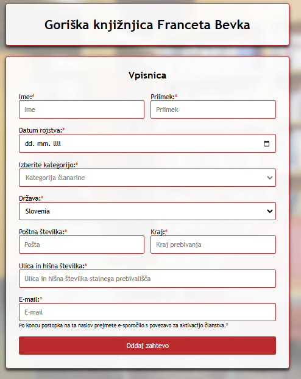

# Obrazec

Obrazec za knjižnjico Nova Gorica

## Kratek opis

Obrazec je zasnovan v HTML-ju, pri čemer sem dodal vizualne prilagoditve z uporabo CSS-a in funkcionalnost z JavaScriptom. Vključeni so tudi SweetAlert pop-upi, ki uporabnike opozorijo na morebitne napake ter preverijo, ali so vsa obvezna polja pravilno izpolnjena.

## Slike

## Avtor

Mitja Filej
